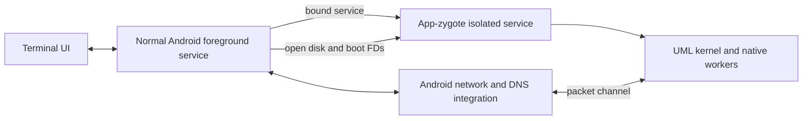

# App-zygote hosting research

2026-09-20. Goblin now hosts the complete ARM64 UML kernel in an app-zygote
isolated Android service. The Samsung SM-S928U and Android 16 emulators with
4 KiB and 16 KiB host pages have booted the existing Debian disk under this
service. No global child-process setting, SELinux setting, or device-wide process
limit was changed. See [integration results](../harness/results/app-zygote/README.md)
for the tested APKs and remaining coverage boundaries.

The normal APK installation supplies this behavior. Linux accounts, packages,
files, hardware CPU count, memory sizing and the kitty terminal are preserved.
The isolated kernel receives open disk, boot and transport descriptors over
Binder. Networking runs in a separate Android-managed service with the app UID.

| Experiment | Host | Result |
| --- | --- | --- |
| Isolated service, 64 native children, 180 seconds | Android 16 emulators, 4 KiB/8 CPUs and 16 KiB/4 CPUs | All workers completed; no matching phantom records |
| Ordinary service control, same executable and 180-second target | Android 16 emulator, 4 KiB/8 CPUs | Helper killed after about 144 seconds; ActivityManager logged phantom trimming |
| Isolated service probe, 64 children, 600 seconds | Samsung SM-S928U, Android 16, 4 KiB/8 CPUs | All workers completed under unchanged policy |
| Full UML, native multicore stress, 600 seconds | Samsung SM-S928U | 110 iterations completed, peak 70 observed workers, no phantom records, no workers surviving shutdown |
| Signed APK, full UML stress, 600 seconds | Android 16 emulator, 4 KiB/8 CPUs | 107 iterations completed |
| Final signed APK, kernel #14, full UML stress, 600 seconds | Samsung SM-S928U | 110 iterations completed, peak 77 observed workers, no phantom records or workers left after shutdown |

The first full-guest runs used kernel build #13; the final #14 build also fixes
serial input backpressure and passed its own phone soak. Reports identify which
build was tested.
Every observed run retained `max_phantom_processes=32`, an unset global override,
an empty persistent feature override, and SELinux `Enforcing`. The probe used
public service binding and JNI, without root, shell privileges, hidden Android
APIs, or adopted shell permissions. Worker counts are workload sizes, not limits.

The probe kept one busy native worker per hardware CPU and shared heartbeats
from the remaining workers. The full guest exercises parallel instructions,
per-CPU TLS, mapping coherence, migration, signals and fork/exec. These are bounded
acceptance workloads, not long-term availability guarantees or phone benchmarks.
The ordinary-service control ran separately, rather than on a synchronized scan.

The executable probe also verified these prerequisites in the isolated domain:

- A native ELF packaged in the APK can be launched with `execve`.
- A private disk descriptor passed over Binder permits writes, `fsync`, and shared
  mapping, without granting access to the app's private directory.
- An already-connected TCP socket passed over Binder can send data, confirmed by
  the receiving socket in the parent app.
- A locally created memfd supports a writable shared mapping and a fixed-address
  executable alias; ARM64 code executed successfully from that alias.
- A separate `CLONE_VM | SIGCHLD` worker shares memory with its creator.
- An additional seccomp filter can trap a syscall with SIGSYS and return an
  emulated result through the signal context.

The probe alone did not exercise the complete UML worker protocol. The subsequent
full-guest boots and multicore workloads now cover the actual worker flags,
packaged-stub execution, persistent disk access and kernel startup.

Android source explains why this is worth pursuing. `PhantomProcessList` skips
parents marked `appZygote`. `ProcessRecord` uses that flag for the isolated UID
range allocated to services launched through an application zygote. Source
inspection found the exclusion in Android 12, 13, 14, 15, 16, Android 16 QPR2, and
the AOSP main branch fetched for this investigation. Child-process accounting
uses cgroups. The probe's native helper remained in `isolated_app` with its
normal cgroup.
[Process scanner](https://raw.githubusercontent.com/aosp-mirror/platform_frameworks_base/android16-release/services/core/java/com/android/server/am/PhantomProcessList.java),
[process classification](https://raw.githubusercontent.com/aosp-mirror/platform_frameworks_base/android16-release/services/core/java/com/android/server/am/ProcessRecord.java).

The implemented service declares `android:isolatedProcess="true"` and
`android:useAppZygote="true"`. The public manifest mechanism is supported, but
exclusion from phantom monitoring is an implementation detail, not a documented
compatibility guarantee. Vendor changes or a future Android update could alter
it. Android also limits the number of isolated service instances from an app
zygote; this design needs one service for the whole Linux instance.
[Manifest attribute definitions](https://raw.githubusercontent.com/aosp-mirror/platform_frameworks_base/android16-release/core/res/res/values/attrs_manifest.xml).

The isolated UID has no application permissions of its own. Its policy permits
using open app-data descriptors received over IPC but prohibits opening those
files directly and creating Internet sockets. Our experiments confirmed direct
private-path access and direct TCP socket creation fail. Reopening a passed disk
descriptor through `/proc/self/fd/3` also failed with `EACCES`. Therefore, merely
substituting that pathname for the existing disk path will not work.
[Isolated-service documentation](https://developer.android.com/guide/topics/manifest/service-element),
[isolated-app policy](https://android.googlesource.com/platform/system/sepolicy/+/android16-release/private/isolated_app_all.te).

The implemented division of responsibilities is:

The normal foreground service owns wake locks, notification state, APK asset
updates, backup/restore, DNS and the service binding. Closing every terminal
keeps the binding alive. The isolated host retains the disk lock until its UML
workers are reaped; status pipes and Binder death handling report failure.
Android can still terminate the app under memory pressure or after force-stop.

The implementation is in [ManagedLinux.java](../harness/java/dev/goblinlinux/sentry/ManagedLinux.java),
[launcher.cpp](../uml/launcher.cpp), [runtime.cpp](../uml/runtime.cpp), and
[the kernel patches](../uml/patches/). UML consumes `fd:N` directly and disables
host UMID files with `uml_dir=none`. Read-only block descriptors carry boot assets
and the seed/migration archive; there is no live hostfs deployment mount.
[NetworkService.java](../harness/java/dev/goblinlinux/sentry/NetworkService.java)
hosts passt's event loop without another long-lived native child.

Acceptance covers existing-disk upgrades, full guest boot, multicore execution,
sudo, independent terminals, systemd services, IPv4/IPv6 forwarding, DNS, backup,
restore, rescue and wake-lock handling. The Samsung also passed a real five-minute
unplugged, screen-off run after the user's call ended, without a battery-optimization
exemption: 301 Android power samples, 281 guest heartbeat increments and no Linux
restart. This bounded result does not establish indefinite operation, deep Doze
behavior, or broader Android/vendor coverage. See the linked raw results.

Probe source and raw evidence are in [probe/appzygote](../probe/appzygote/README.md).
Integration reports are separate from the original standalone feasibility tests.
