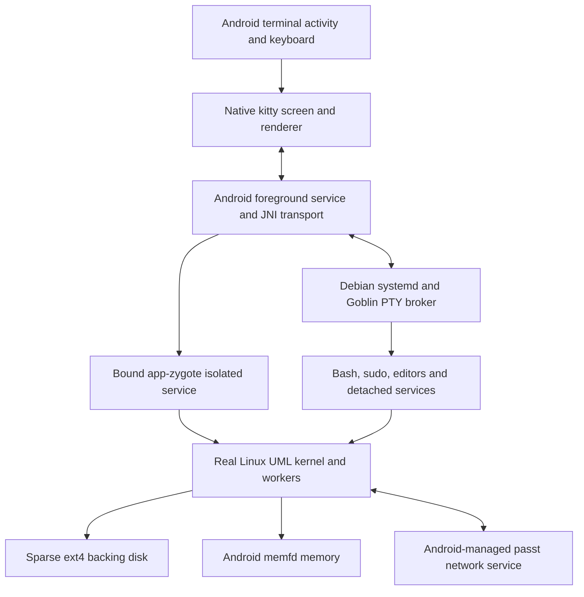

# Architecture

Goblin runs the pinned ARM64/Android Linux UML kernel. The Android frontend and
kitty rendering remain intact; the previous syscall implementation is absent
from the production APK build.

The app installs the kernel and its userspace stub as packaged native executables.
The kernel and its workers run under one app-zygote isolated service and execute guest ARM64 code
natively through UML's seccomp backend. Linux itself handles syscall semantics,
ELF loading, scheduling, signals, virtual memory, credentials, procfs, sockets and
filesystem operations. Goblin's framed serial protocol carries terminal bytes,
window sizes and lifecycle requests, not guest syscalls.

Each startup gives UML the configured hardware CPU count. For ARM64 seccomp,
each guest address space has lazily allocated execution workers on its CPUs.
Their host mappings are shared, while signal frames, registers, TLS and handoff
state are independent. A dedicated mapping worker performs synchronous mapping
revocation across that shared address space. Threads can therefore execute
concurrently without sharing a register frame or retaining stale permissions.

The Android foreground service owns the VM binding independently of activities
and terminals. Debian systemd runs as PID 1 and supervises guest services. The
Goblin broker owns Linux PTYs and starts shells with real UID/GID/groups and home
directories, including Debian PAM/logind sessions. Each terminal has an independent kitty screen.
Closing a PTY uses Linux hangup semantics; detached services can survive. The
notification's shutdown action requests a guest sync and poweroff. Android
force-stop or app-process death ends the VM, like abrupt machine power loss.
The service owns an untimed partial wake lock while Linux runs. Users can
disable it in the terminal menu and open Android's battery settings to grant
the separate exemption needed for operation during Doze.

The initramfs prepares ext4 and imports either the previous Debian installation
or the packaged seed. Guest account, sudo and repository setup run in Linux,
using the existing deployment assets. The migration does not change host user
accounts or install Debian packages on Android or the development machine.

RAM is backed by memfd rather than flash files. Its configured capacity comes
from the phone's physical-memory report. The sparse disk's logical capacity
comes from the app filesystem's capacity. Goblin does not add a smaller quota,
process count, terminal count, runtime deadline or CPU allowance. Normal Linux
rlimits, cgroups and sysctls remain under guest-root control; Android's enforcement
and the actual available resources remain host constraints.

The foreground service opens the existing disk and supplies descriptors through
Binder. UML consumes `fd:N` directly, including initrd and a read-only boot archive;
it never reopens private paths through `/proc/self/fd`. Boot assets are unpacked
inside the guest and replace the former live hostfs deployment mount. The kernel
host retains the disk lock until all workers are reaped. Exit pipes and Binder
death handling propagate host failures back to the session service.

Internet sockets belong to a separate, ordinary app-UID Android service running
passt's event loop. Android DNS requests remain with the foreground service.
Neither long-running host is a raw child of the UI process. Current Android
app-zygote accounting avoids the phantom-child count restriction; no device-wide
monitoring setting is changed. This behavior remains subject to Android/vendor
changes, memory pressure and normal service lifecycle enforcement.

Android UIDs and SELinux domains remain the outer boundary. Guest root
controls Linux and its disk, but does not obtain Android root or direct hardware
access. The packaged diagnostic client uses a private app-UID Unix socket to
control guest-root commands for tests. It is not exposed over the network.

See [the UML implementation guide](../uml/README.md) for source pins, build
instructions, migration format, tests and current port/integration boundaries.
